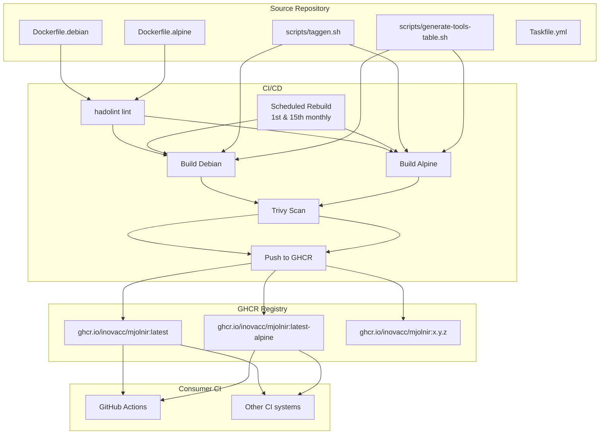
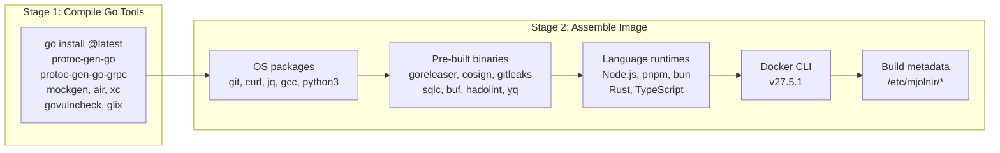

# Architecture

## System Overview



## Build Process



## Project Structure

```
mjolnir/
├── Dockerfile.debian          # Debian-based image (default)
├── Dockerfile.alpine          # Alpine-based image (smaller)
├── Taskfile.yml               # Local build/dev tasks
├── CLAUDE.md                  # Project conventions
├── README.md                  # User-facing documentation
├── LICENSE                    # MIT license
├── scripts/
│   ├── generate-tools-table.sh  # Builds ASCII tools table at build time
│   └── taggen.sh                # Mythology-themed tag generator
├── examples/
│   ├── go/                    # GoReleaser + Cobra example
│   ├── rust/                  # Actix-web example
│   ├── typescript/            # Bun example
│   └── python/                # FastAPI example
├── docs/
│   ├── ARCHITECTURE.md        # This file
│   ├── ROADMAP.md             # Development phases
│   ├── BACKLOG.md             # Prioritized work items
│   └── ISSUES.md              # Known issues
└── .github/workflows/
    ├── ci.yml                 # Main CI pipeline (tag + PR)
    └── scheduled-build.yml    # Bi-weekly rebuilds
```

## Tool Installation Methods

| Method | Tools | Reproducibility |
|--------|-------|-----------------|
| `go install @latest` | protoc-gen-go, protoc-gen-go-grpc, mockgen, air, xc, govulncheck, glix | Low (unpinned) |
| GitHub Releases API (`latest`) | goreleaser, cosign, gitleaks, sqlc, buf, hadolint, yq | Low (unpinned) |
| Install scripts (`latest`) | golangci-lint, syft, task, bun | Low (unpinned) |
| OS package manager | git, curl, jq, python3, Node.js, npm, gcc | Medium (base image pins) |
| Pinned version | Docker CLI (27.5.1), TypeScript (5.9.3) | High |
| Channel | Rust (stable), Go (1.25.x) | Medium |
